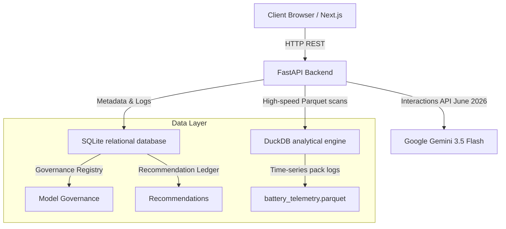

# VoltReturn
### An AI-Powered Decision Intelligence Platform for African Electric Mobility & Finance

VoltReturn is an enterprise-grade decision-support platform designed for electric motorcycle (boda boda) operators, pay-as-you-go (PAYG) asset financiers, and climate finance investors in East Africa. 

---

## 1. The Strategic Business Challenge

In the East African electric mobility sector, scaling infrastructure (Battery Swap Stations — BSS) presents a classic chicken-and-egg coordination problem. Operators cannot justify the CapEx of deploying swap cabinets without an active rider base, while riders cannot transition to EVs without station density to eliminate range anxiety. 

At the same time, financing companies ( Mogo, Watu, M-KOPA) deploy billions of shillings in PAYG loans without understanding how physical infrastructure proximity directly impacts borrower credit risk. **Distance to the nearest BSS is the single strongest predictor of payment default.** A rider operating far from a BSS spends critical operating hours traveling to swaps, losing daily revenue.

VoltReturn bridges this gap. It turns raw spatial, financial, and battery telemetry data into actionable deployment decisions, credit risk audits, and investment evaluations.

---

## 2. Platform Architecture

The system features a modular backend (FastAPI, SQLite, DuckDB) integrated with a modern web dashboard.



---

## 3. Product Modules Overview

VoltReturn is composed of six analytical modules (detailed inside [docs/MODULES.md](file:///docs/MODULES.md)):
1. **Infrastructure Intelligence**: Identifies underserved spatial centroids among **66 active swap stations** in Nairobi. Suggests optimal new locations using sample-weighted K-Means placement algorithms.
2. **Fleet Intelligence**: Evaluates capacity fade on cell telemetry. Applies Weibull survival probability functions to estimate Remaining Useful Life (RUL) cycles.
3. **Rider Intelligence**: Computes borrower credit default risk (logistic regression) and customer churn probability.
4. **Investment Intelligence**: Generates Year 1-5 financial cash flows, numerical IRR (Newton-Raphson method), sensitivity tornado swings, and Monte Carlo probability spreads.
5. **Operations Intelligence**: Forecasts battery swaps and grid loading schedules.
6. **Sustainability Intelligence**: Calculates CO2 displacement under Verra VM0038 rules to project carbon credit values.

For the mathematical formulations, refer to the [docs/MATHEMATICAL_MODELS.md](file:///docs/MATHEMATICAL_MODELS.md) guide.

---

## 4. Key Enterprise Systems

### A. Data Quality Engine
To address the data reality limits, every dataset ingested undergoes validation checks (null counts, coordinates checking, duplicates, value ranges) logged inside SQLite, generating a **Usability Score** and warning flags before running models.

### B. Model Governance Registry
Audits and version-controls all predictive models. Logged details (features, fitted weights, intercepts, scaling parameters, and validation metrics like Accuracy/AUC) are recorded in SQLite to ensure ML audit compliance.

### C. Investment Committee Mode (Board Memo Generator)
Compiles all simulated spatial, financial, and ESG outputs into a styled 5-page PDF board memorandum (via ReportLab) suitable for investment reviews.

### D. AI Decision Assistant
A RAG reasoning pipeline powered by the **June 2026 google-genai Interactions API**. Queries DuckDB for metrics, context-grounds the numbers, and returns a hallucination-free business summary.

---

## 5. Local Setup & Execution

### Prerequisites
* Python 3.10+ installed
* Standard virtual environment

### 1. Configure the Virtual Environment
```bash
# Create venv
python -m venv venv

# Activate venv (Windows PowerShell)
.\venv\Scripts\activate

# Install dependencies with pre-compiled wheels
pip install -r backend/requirements.txt --prefer-binary
```

### 2. Configure Environment Variables
Create a `.env` file in the root `backend/` folder:
```bash
GEMINI_API_KEY=your_gemini_api_key_here
DATABASE_URL=sqlite:///backend.db
DUCKDB_PATH=data/emobility.duckdb
```

### 3. Seed the Database & Simulate Telemetry
This compiles the local database, generates 1,000 rider loans, generates 5,000 battery telemetry parquet files, and fits/registers baseline ML models:
```bash
python -m backend.app.core.setup_data
```

### 4. Launch the FastAPI Analytical Server
```bash
python -m backend.app.main
```
*Access OpenAPI Swagger docs at `http://127.0.0.1:8000/docs`.*

---

## 6. Automated Testing

Verify the mathematical modeling, database logs, and service logic via pytest:
```bash
python -m pytest backend/app/tests/
```
