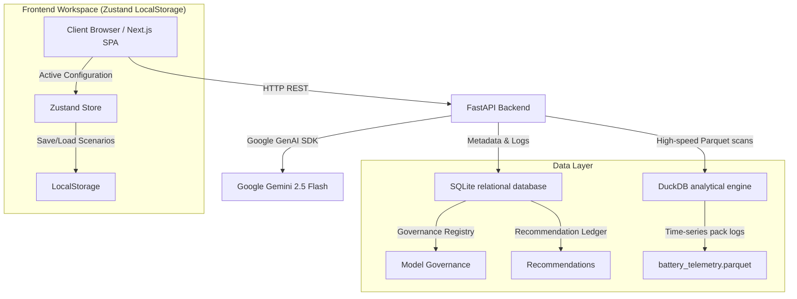

# VoltReturn
### An AI-Powered Decision Intelligence Platform for African Electric Mobility & Finance

VoltReturn is an enterprise-grade investment decision and analytics platform designed for electric motorcycle (boda boda) operators, pay-as-you-go (PAYG) asset financiers, and climate finance investors in East Africa.

---

## 1. The Strategic Business Challenge

In the East African electric mobility sector, scaling infrastructure (Battery Swap Stations — BSS) presents a classic chicken-and-egg coordination problem. Operators cannot justify the CapEx of deploying swap cabinets without an active rider base, while riders cannot transition to EVs without station density to eliminate range anxiety. 

At the same time, financing companies (Mogo, Watu, M-KOPA) deploy billions of shillings in PAYG loans without understanding how physical infrastructure proximity directly impacts borrower credit risk. **Distance to the nearest BSS is the single strongest predictor of payment default.** A rider operating far from a BSS spends critical operating hours traveling to swaps, losing daily revenue.

VoltReturn bridges this gap. It turns raw spatial, financial, and battery telemetry data into actionable deployment decisions, credit risk audits, and investment evaluations.

---

## 2. Platform Architecture

VoltReturn features a decoupled Monorepo structure, combining a FastAPI analytical backend with a modern, high-performance Next.js single-page application (SPA).



---

## 3. Product Modules Overview

VoltReturn is composed of six analytical modules (detailed inside [docs/MODULES.md](docs/MODULES.md)):
1. **Infrastructure Intelligence**: Identifies underserved spatial centroids among **66 active swap stations** in Nairobi. Suggests optimal new locations using sample-weighted K-Means placement algorithms.
2. **Fleet Intelligence**: Evaluates capacity fade on cell telemetry. Applies Weibull survival probability functions to estimate Remaining Useful Life (RUL) cycles. Supports live IoT data streams via the new Telemetry Ingestion API.
3. **Rider Intelligence**: Computes borrower credit default risk (logistic regression) and customer churn probability.
4. **Investment Intelligence**: Generates Year 1-5 financial cash flows, numerical IRR (Newton-Raphson method), sensitivity tornado swings, and Monte Carlo probability spreads.
5. **Operations Intelligence**: Forecasts battery swaps and grid loading schedules.
6. **Sustainability Intelligence**: Calculates CO2 displacement under Verra VM0038 rules to project carbon credit values.

For the mathematical formulations, refer to the [docs/MATHEMATICAL_MODELS.md](docs/MATHEMATICAL_MODELS.md) guide.

---

## 4. Key Enterprise Systems

### A. Dynamic GIS Mapping Workspace
An interactive dark-themed spatial mapping workspace powered by Leaflet and CartoDB Dark Matter tiles. Layers can be toggled to render Nairobi's active swap station network, recommended centroids (highlighted with neon-green pulse indicators), population density, and default risk hotspots.

### B. Corporate Finance Analytics
Integrates high-end Recharts components to represent complex financial outcomes:
* **Monte Carlo Fan Chart**: Shaded area bands showing NPV probability densities.
* **Cash Flow Waterfall**: Breakdown of revenues against charging costs and PAYG credit write-offs.
* **Sensitivity Tornado**: Elasticity rankings of critical business drivers (tariffs, default rates, swap demand).
* **Risk-Return Matrix**: Bubble scatter plot mapping saved scenarios across Risk (default probability) and Return (IRR), identifying the efficient frontier.

### C. Persistent Scenario Management
Allows users to save and name multiple capital configurations locally. Persisted in browser LocalStorage via Zustand, scenarios can be loaded instantly or evaluated side-by-side inside a comparative matrix.

### D. Board Presentation Mode (Board Mode)
A one-click toggle that optimizes the layout for presentation settings. Hides sidebars, centers scorecards, and increases typography sizes to ease visual review during board meetings.

### E. McKinsey-Style Brief & PDF Exports
Includes a print-friendly in-browser investment memo styled according to the McKinsey formatting brief, linked directly to the backend ReportLab PDF compiler for immediate exports.

### F. AI Decision Advisor
A RAG strategy console powered by the **Google GenAI SDK (Gemini 2.5 Flash)**. Queries DuckDB for metrics, context-grounds the numbers, and returns grounded business recommendations.

---

## 5. Live Telemetry Ingestion API

To ingest live telemetry from swap cabinets or IoT tracking devices:
* **Endpoint**: `POST /api/v1/fleet/ingest`
* **Content-Type**: `application/json`
* **Request Payload**:
```json
{
  "records": [
    {
      "battery_id": "BATT-001",
      "vehicle_id": "VEH-102",
      "timestamp": "2026-07-16T12:00:00Z",
      "soh": 98.5,
      "soc": 85.0,
      "cycle_count": 150,
      "temperature": 32.5
    }
  ]
}
```
* The API runs data quality checks (logging boundary violations and null counts to SQLite `data_quality_logs`), and appends the validated logs directly to the underlying `battery_telemetry.parquet` database file.

---

## 6. Vercel & Production Deployment

VoltReturn is fully configured to deploy both frontend and backend on Vercel as a single unified monorepo:
* **Vercel Config**: `vercel.json` maps Next.js frontend builds and Python FastAPI serverless function runtimes.
* **Database Portability**: Detects the serverless environment and automatically routes SQLite writes to the writeable `/tmp` directory.
* **Routing**: Rewrites all `/api/v1/*` routes to the python backend service, serving pages from the frontend service.

---

## 7. Local Setup & Execution

### Prerequisites
* Python 3.10+ installed
* Node.js 18+ installed

### 1. Configure the Backend analytical server
```bash
# Create venv and activate
cd backend
python -m venv venv
.\venv\Scripts\activate

# Install dependencies and seed data
pip install -r requirements.txt --prefer-binary
python -m app.core.setup_data

# Launch FastAPI server
python -m app.main
```
*Access OpenAPI Swagger docs at `http://127.0.0.1:8000/docs`.*

### 2. Configure the Next.js Frontend Client
Open a new terminal window:
```bash
cd frontend

# Install package dependencies
npm install

# Start development workspace
npm run dev
```
*Access the platform in your browser at `http://localhost:3000` or `http://127.0.0.1:3000`.*

---

## 8. Automated Testing

Verify the mathematical modeling, database logs, and service logic via pytest:
```bash
python -m pytest backend/app/tests/
```
